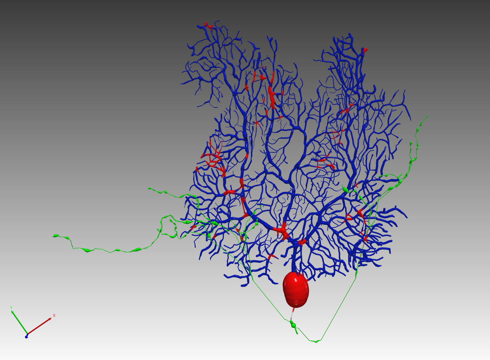

# Branch Intersection Detection for SWC/NEURON Morphology

This module reads a SWC(`.swc`) or NEURON (`.nrn`) morphology file commonly used in Light
Microscopic (LM) image reconstruction, then detects and labels the intersected branches
based on spherical interpolation and graph theory. The detected intersections are written
to an output file for curation.

## Prerequisite
* Python3.6 or above
* numpy
* networkx
* rtree
* (optional) [NEURON with python integration](https://neuron.yale.edu/neuron/)
if the morphology is in `.nrn` format


## Download and Installation
```
git clone https://github.com/CNS-OIST/SWCIntersectDetect.git
cd SWCIntersectDetect
python steup.py install
```

## Usage
in `Python` interface, import the module
```
import swc_intersect_detect
```

If you want to convert NEURON `.nrn` morphology to `.swc` file, use
```
from swc_intersect_detect import morph_io
morph_io.nrn2swc(NRN_FILE, SWC_OUTPUT)
```

To perform intersection detection, use
```
swc_intersect_detect.run(SWC_FILE)
```

for more parameter control details, use
```
help(swc_intersect_detect.run)
```

## Example
An example is provided in [example/purkinje.py](example/purkinje.py), which first converts the 
[example/Purkinje19b972-1.nrn](example/Purkinje19b972-1.nrn) morphology to a swc file, then performs intersection detection on the morphology data. The curation file can be visualized in
[neuTube](https://www.neutracing.com/) as below, with curation tag (intersections) colored `red`.

